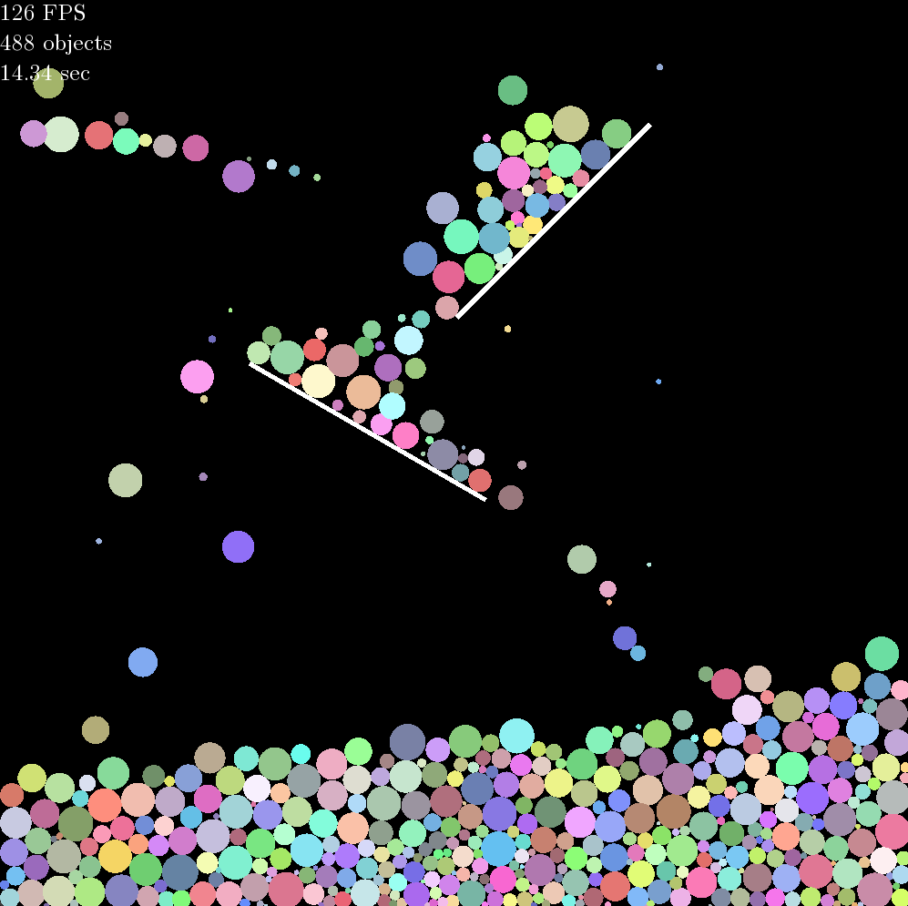

# Three different implementations of collision physics

Implemented with a naive algorithm of collision detection.

Minimum requirements: C++ 17, SFML 2.6, and CMake 3.10.

Before building, make sure to change your path to SFML in CMakeLists.txt.

\
\
\
